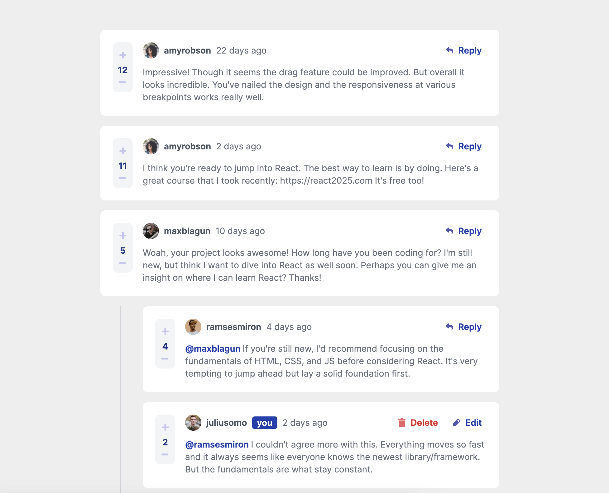
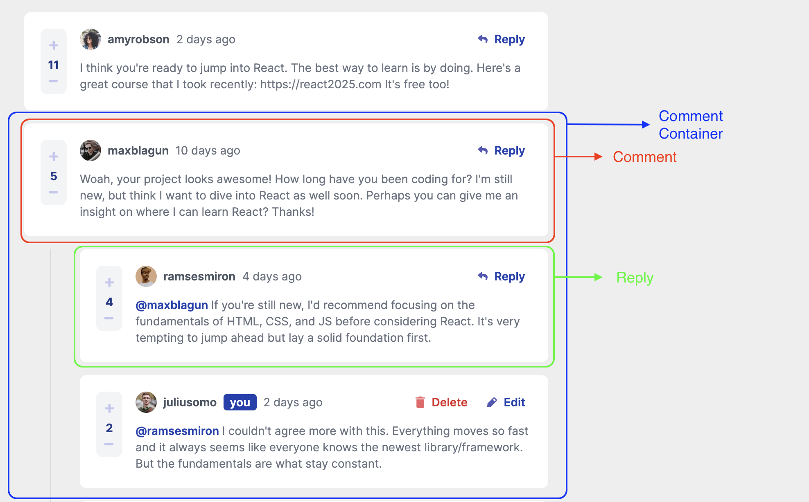
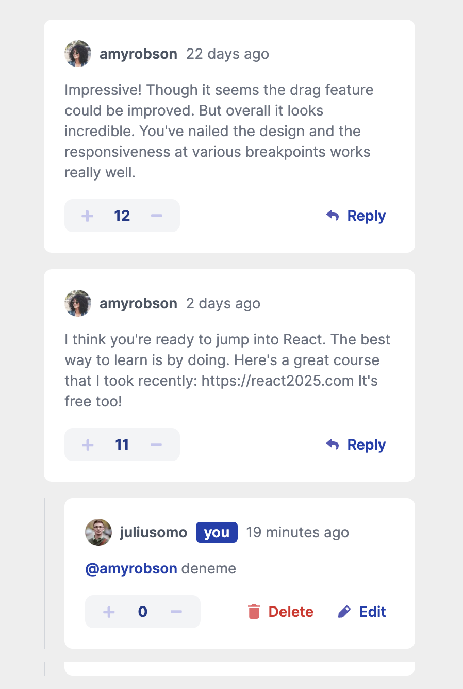

# Interactive Comments 

This is a solution to the [Interactive comments section challenge on Frontend Mentor](https://www.frontendmentor.io/challenges/interactive-comments-section-iG1RugEG9). Frontend Mentor challenges help you improve your coding skills by building realistic projects. 

## Live Site

Check out the live site [here](https://interactive-comments-rho.vercel.app/).

## Screenshots

Here are the main page and the visual explanation for the components.
### Main Page

### Components related to Comments Explanation

### Mobile Version

## Features

- First-level comments are ordered by their score, whereas nested replies are ordered by time added. Upvoting and downvoting scores on the first level comments changes the order.
- Replying to a comment adds the new reply to the bottom of the nested replies within that comment.
- A confirmation modal pops up before a comment or reply is deleted.
- You can only edit or delete your own comments and replies.
- **Bonus1**: System stores all the comments and replies on the localStore so the data persists when the browser refreshed.
- **Bonus2**: System uses a `timestamp` and dynamically track the time since the comment or reply created. At first, there was a static `createdAt` string on data.json file.

`Note:` Adding a new comment or reply uses the `currentUser` object from within the `data/data.json` file.

Users also have a chance to to:

- [x] view the optimal layout for the app depending on their device's screen size (desktop and mobile)
- [x] see hover states for all interactive elements on the page

## Tech Stack

The project is built using the following technologies:

- React: A JavaScript library for building user interfaces.
- Nextjs: A javascript framework works top on the React and uses all the benefits of React. It helps for SSG, SSR and routing.
- Tailwind CSS: A utility-first CSS framework that enables rapid UI development with pre-defined styles and components. Flexbox and Grid structure has been used for creating the layout.
- Typescript: Type safe version of Javascript.

## Installation and Usage

- Clone the repository: `git clone https://github.com/mehmetakifakkus/interactive-comments.git`
- Navigate to the project directory: `cd rest-api-countries`
- Run `npm install` to install project dependencies.
- Run `npm run dev` to start the development server.
- Open your browser and visit `http://localhost:3000` (or the specified port) to view the application.

## Folder Structure

- `app`: Contains the source code of the Nextjs application. It uses Nextjs app router.
  - `page.tsx`: Entry point of the application that runs when routing is `/`.
  - `components`: Contains reusable React components used throughout the application.
  - `context`: It contains context used in the application. There are two context: 1) User context: stores main user that interacts with the comments section 2) Comments context which makes comments and their replies available throughout the application
  - `data`: This folder includes static json data includes all the comments and the replies.
  - `hooks`: It includes custom hooks.
  - `globals.css`: Contains Tailwind directives and custom styles for the application.
  - `screenshots`: Includes screenshots of the application.
  - `utils`: This folder includes all the utilities.

## Deployment

To deploy the application to production, run `npm run build`. This will create an optimized build in the dist folder, which can be deployed to a web server or hosting service of your choice.

## Contributing

Contributions to the project are welcome! Feel free to open issues and pull requests for bug fixes, improvements, or new features.

## Author

- Website - [mehmetakifakkus](https://mehmetakifakkus.github.io)
- Frontend Mentor - [@mehmetakifakkus](https://www.frontendmentor.io/profile/mehmetakifakkus)
## License

This project is licensed under the [MIT License](LICENSE).
